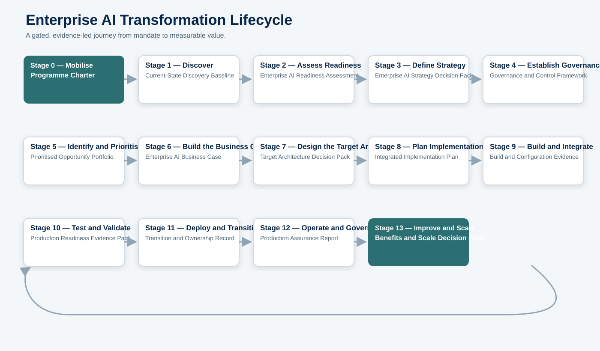
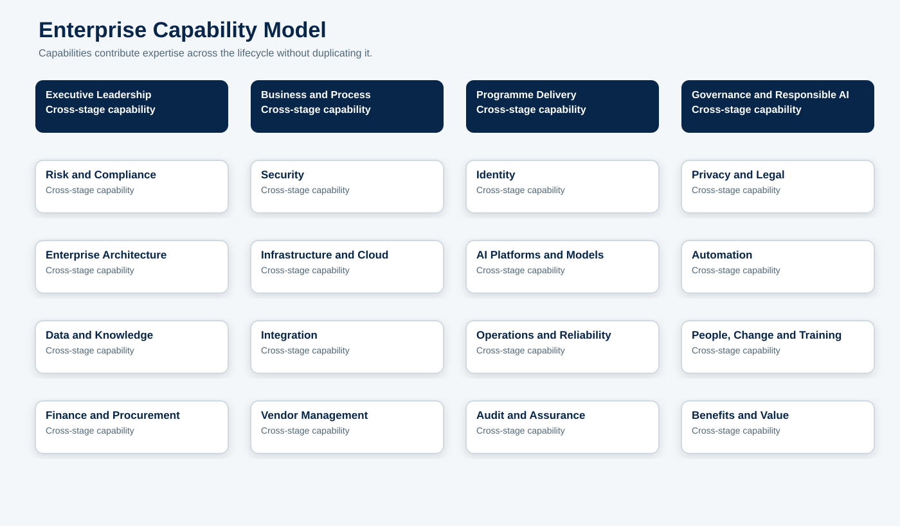
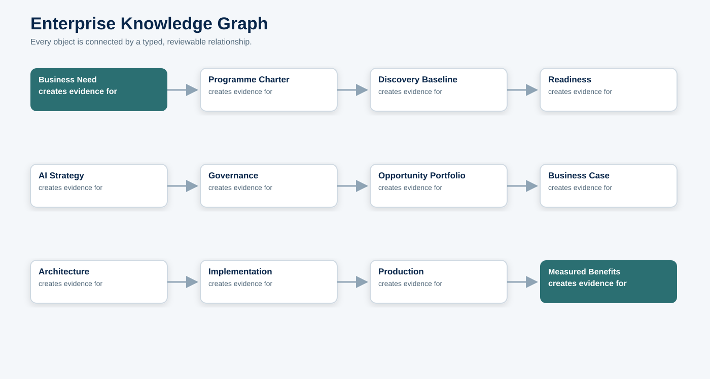
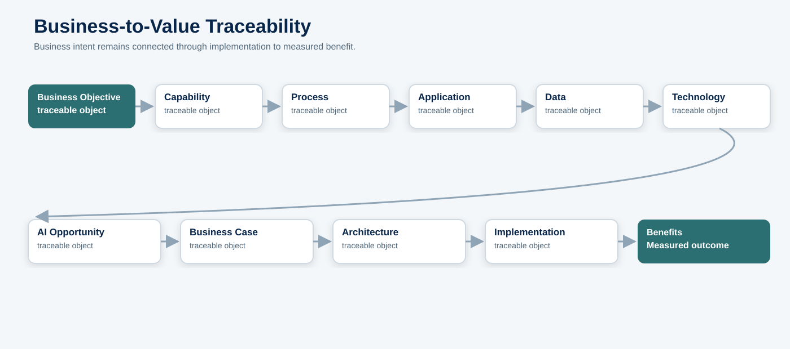
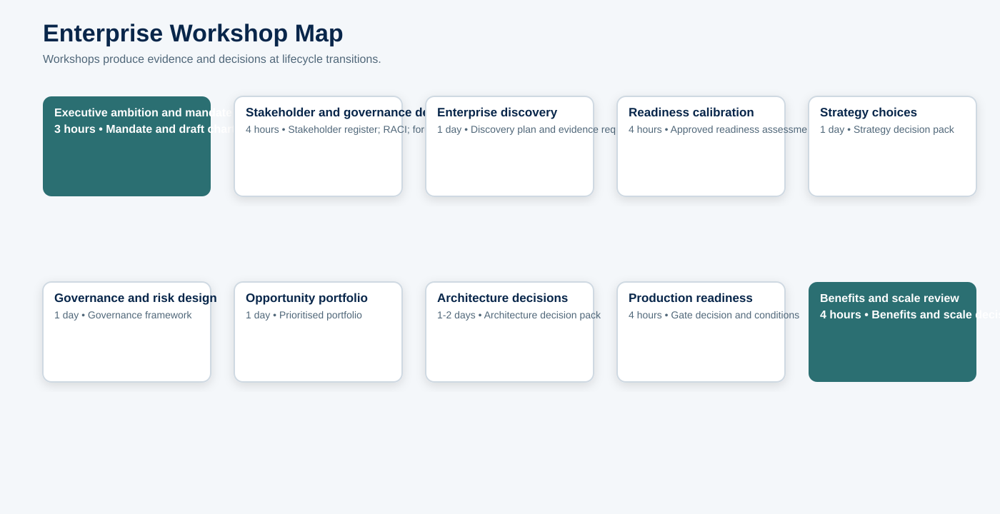
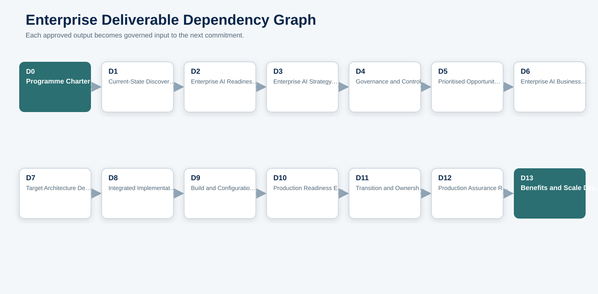
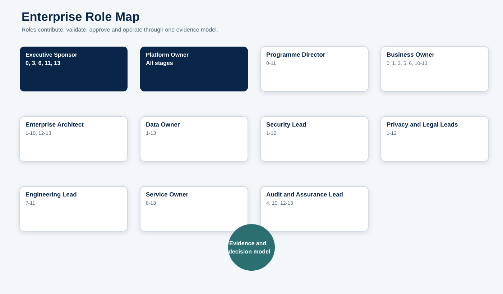
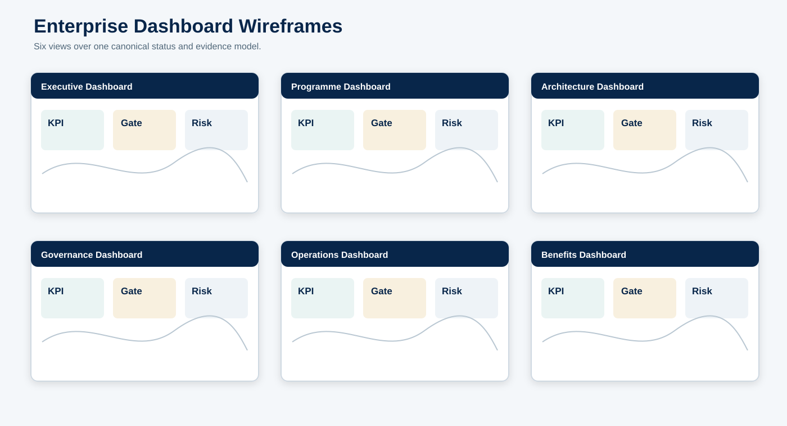
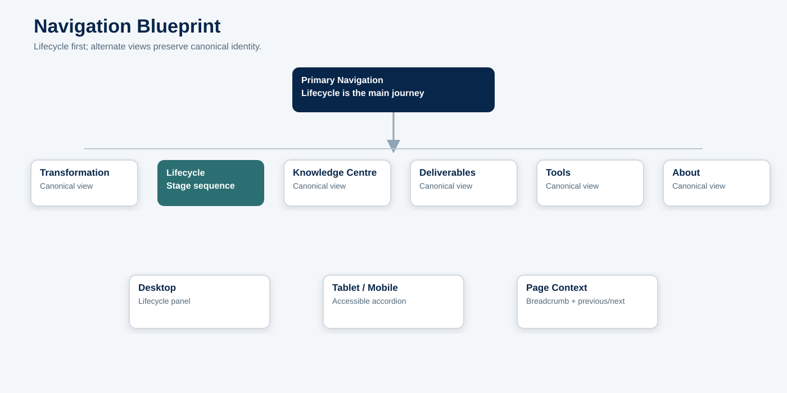
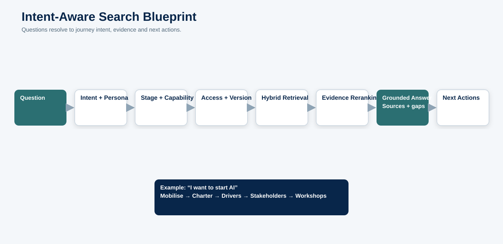

# Enterprise AI Transformation Blueprint

> **Governing purpose:** explain how an organisation moves from AI ambition to governed, secure, measurable enterprise value. This blueprint integrates the Phase 0 information architecture; it does not redesign it.

**Document owner:** Platform Owner  
**Methodology owner:** Enterprise AI Methodology Lead  
**Change control:** no future structure, menu, deliverable or workflow may conflict with this blueprint without an approved change record.  
**Production status:** non-production design artifact; no deployment or route change is authorised.

## How to read this blueprint

The lifecycle is the primary journey. Capabilities supply expertise. Information becomes governed deliverables. Deliverables support decisions. Decisions release the next stage. Knowledge articles explain reusable concepts without replacing the methodology. AI assistance accelerates drafting and analysis but never assumes authority.

# Part 1 — Executive Vision

Architecting AI is a complete Enterprise AI Transformation Methodology. It helps leaders and delivery teams turn an initial business need into an operated capability with accountable decisions, evidence, controls and measurable benefits.

The problem is rarely a lack of AI ideas. Organisations struggle because strategy, governance, data, security, architecture, delivery, operations and value measurement are treated as separate projects. The platform connects them through one lifecycle and one language.

It serves executives, business owners, programme leaders, architects, data and engineering teams, security, privacy, legal, risk, procurement, finance, operations, change, audit and learners. Its differentiator is traceability: a stated objective must remain connected to capability, process, data, opportunity, investment, architecture, implementation, control evidence and realised benefit.

# Part 2 — Transformation Story

A transformation begins with a business need: improve service, manage risk, grow capacity, reduce friction or create a new capability. Stage 0 converts that need into mandate and accountable scope. Stage 1 collects the current-state evidence. Stage 2 determines whether the organisation is ready and what must be remediated. Stage 3 turns ambition into choices and a roadmap.

Stage 4 establishes the rules and decision rights before opportunity selection becomes investment pressure. Stage 5 chooses problems worth solving. Stage 6 tests whether the expected value justifies cost and risk. Stage 7 designs the target state. Stage 8 builds an executable plan. Stage 9 implements it. Stage 10 proves it.

Stage 11 releases and transfers ownership. Stage 12 operates and governs the live service. Stage 13 compares actual results with the approved case, then improves, scales or retires the capability. Its evidence becomes new discovery input, making transformation a managed learning cycle.

# Part 3 — Complete Enterprise Lifecycle

| Stage | Why it exists | Primary output | Gate |
|---|---|---|---|
| 0 — Mobilise | Create the mandate, scope, sponsorship and programme controls. | Programme Charter | Mobilisation approved |
| 1 — Discover | Establish an evidence-based current-state baseline. | Current-State Discovery Baseline | Discovery accepted |
| 2 — Assess Readiness | Measure capability, evidence gaps and remediation priorities. | Enterprise AI Readiness Assessment | Readiness disposition approved |
| 3 — Define Strategy | Agree ambition, outcomes, operating model and roadmap. | Enterprise AI Strategy Decision Pack | Strategy approved |
| 4 — Establish Governance | Put decision rights, policies, controls and assurance in place. | Governance and Control Framework | Governance approved |
| 5 — Identify and Prioritise Opportunities | Create and balance a governed opportunity portfolio. | Prioritised Opportunity Portfolio | Portfolio approved |
| 6 — Build the Business Case | Make benefits, costs, assumptions and funding transparent. | Enterprise AI Business Case | Investment approved |
| 7 — Design the Target Architecture | Turn strategy and controls into an implementable target state. | Target Architecture Decision Pack | Architecture approved |
| 8 — Plan Implementation | Create the integrated delivery, change, test and transition plan. | Integrated Implementation Plan | Plan approved |
| 9 — Build and Integrate | Configure, integrate and document the governed solution. | Build and Configuration Evidence | Build completion approved |
| 10 — Test and Validate | Prove functional, AI, security, control and operational quality. | Production Readiness Evidence Pack | Release candidate accepted |
| 11 — Deploy and Transition | Cut over safely and transfer accountable ownership. | Transition and Ownership Record | Production release approved |
| 12 — Operate and Govern Production | Run, monitor, assure and respond throughout service life. | Production Assurance Report | Continued operation approved |
| 13 — Improve and Scale | Measure value, improve performance and scale reusable capability. | Benefits and Scale Decision Pack | Scale decision approved |

**Dependency rule:** each gate accepts the previous stage’s evidence and authorises the next commitment. A stage may iterate backward when evidence changes; it may not silently bypass a mandatory gate.

# Part 4 — Enterprise Capability Model

1. **Executive Leadership.** Owns a coherent set of skills, decisions, pages and deliverables; it participates across stages rather than becoming a competing lifecycle.
2. **Business and Process.** Owns a coherent set of skills, decisions, pages and deliverables; it participates across stages rather than becoming a competing lifecycle.
3. **Programme Delivery.** Owns a coherent set of skills, decisions, pages and deliverables; it participates across stages rather than becoming a competing lifecycle.
4. **Governance and Responsible AI.** Owns a coherent set of skills, decisions, pages and deliverables; it participates across stages rather than becoming a competing lifecycle.
5. **Risk and Compliance.** Owns a coherent set of skills, decisions, pages and deliverables; it participates across stages rather than becoming a competing lifecycle.
6. **Security.** Owns a coherent set of skills, decisions, pages and deliverables; it participates across stages rather than becoming a competing lifecycle.
7. **Identity.** Owns a coherent set of skills, decisions, pages and deliverables; it participates across stages rather than becoming a competing lifecycle.
8. **Privacy and Legal.** Owns a coherent set of skills, decisions, pages and deliverables; it participates across stages rather than becoming a competing lifecycle.
9. **Enterprise Architecture.** Owns a coherent set of skills, decisions, pages and deliverables; it participates across stages rather than becoming a competing lifecycle.
10. **Infrastructure and Cloud.** Owns a coherent set of skills, decisions, pages and deliverables; it participates across stages rather than becoming a competing lifecycle.
11. **AI Platforms and Models.** Owns a coherent set of skills, decisions, pages and deliverables; it participates across stages rather than becoming a competing lifecycle.
12. **Automation.** Owns a coherent set of skills, decisions, pages and deliverables; it participates across stages rather than becoming a competing lifecycle.
13. **Data and Knowledge.** Owns a coherent set of skills, decisions, pages and deliverables; it participates across stages rather than becoming a competing lifecycle.
14. **Integration.** Owns a coherent set of skills, decisions, pages and deliverables; it participates across stages rather than becoming a competing lifecycle.
15. **Operations and Reliability.** Owns a coherent set of skills, decisions, pages and deliverables; it participates across stages rather than becoming a competing lifecycle.
16. **People, Change and Training.** Owns a coherent set of skills, decisions, pages and deliverables; it participates across stages rather than becoming a competing lifecycle.
17. **Finance and Procurement.** Owns a coherent set of skills, decisions, pages and deliverables; it participates across stages rather than becoming a competing lifecycle.
18. **Vendor Management.** Owns a coherent set of skills, decisions, pages and deliverables; it participates across stages rather than becoming a competing lifecycle.
19. **Audit and Assurance.** Owns a coherent set of skills, decisions, pages and deliverables; it participates across stages rather than becoming a competing lifecycle.
20. **Benefits and Value.** Owns a coherent set of skills, decisions, pages and deliverables; it participates across stages rather than becoming a competing lifecycle.

Every future article has one primary capability, one primary lifecycle location or Knowledge Centre classification, and typed relationships to other capabilities. Capability ownership does not duplicate lifecycle content.

# Part 5 — Enterprise Knowledge Graph

The graph uses stable objects and directional relationships: objectives **drive** capabilities; deliverables **provide evidence to** gates; controls are **implemented by** mechanisms and **verified by** tests; architecture decisions **constrain** implementation; operational measures **validate** benefits.

Minimum object types are stage, capability, page, concept, role, information element, workshop, deliverable, template, decision, gate, checklist item, architecture component, control, test, evidence, measure and benefit.

No published object may be orphaned. Canonical concepts have one definition. Lifecycle pages reference them. Relationships are versioned, reviewed and validated before publication.

# Part 6 — Business Capability Traceability

The traceability record begins with a uniquely identified objective and ends with a measured benefit. Each link records owner, source, version and confidence. A proposed AI opportunity without a capability and process is incomplete. A benefit without a baseline and owner is not measurable. An implementation without approved architecture and controls is not production-ready.

# Part 7 — Information Collection Blueprint

| Information | Purpose | Owner | Collector | Validator | Approver | Evidence | Stage | Used by |
|---|---|---|---|---|---|---|---|---|
| Business drivers and objectives | Explain why change is required | Executive Sponsor | Programme Lead | Business Owner | Executive Sponsor | Mandate and strategy | 0 | Charter; strategy; benefits |
| Stakeholders and decision rights | Establish ownership and engagement | Programme Director | Programme Office | Methodology Lead | Executive Sponsor | Approved register and RACI | 0 | All stage gates |
| Business capabilities and processes | Locate value and operational impact | Business Owner | Business Analysts | Enterprise Architect | Business Owner | Capability/process maps | 1 | Opportunities; architecture; change |
| Applications, integrations and technology | Identify constraints and dependencies | CIO/CTO | Architecture Team | Enterprise Architect | CTO | Current-state repository | 1 | Readiness; architecture; cost |
| Data inventory, quality and classification | Determine lawful, reliable AI inputs | Data Owner | Data Stewards | Security/Privacy | Data Owner | Data catalogue evidence | 1 | Readiness; design; testing; operations |
| AI and automation use cases | Expose current adoption and shadow AI | Business Owners | Discovery Team | Risk Lead | Programme Director | Use-case inventory | 1 | Governance; opportunity portfolio |
| Readiness scores and gaps | Make remediation evidence-based | Capability Owners | Assessment Team | Assurance Lead | Programme Board | Assessment evidence | 2 | Strategy; roadmap; business case |
| Risk appetite and control requirements | Set automation and risk boundaries | Risk Executive | Risk Team | Legal/Security | Risk Executive | Approved policy and controls | 0-4 | Architecture; testing; operations |
| Benefit baseline and cost assumptions | Make value measurable | Finance/Business Owner | Finance Analysts | Finance Lead | Executive Sponsor | Approved baseline | 6 | Funding; operations; scaling |
| Architecture decisions | Preserve rationale and consequences | Enterprise Architect | Architecture Team | Security/Data/Ops | Architecture Review Board | ADRs and models | 7 | Build; test; operations |
| Test and evaluation evidence | Prove quality and control operation | Engineering Lead | Test Teams | Independent Validators | Release Authority | Signed evidence pack | 10 | Deployment; assurance |
| Operational measures and incidents | Control live service and improve it | Service Owner | Operations | Assurance Lead | Platform Owner | Logs, reports, incident records | 12 | Benefits; improvement; scaling |

Information is collected once from the best available source, assigned an owner and reused by reference. A later stage may validate or enrich it; it must not create an independent conflicting copy. Sensitive information carries classification, access, retention and lawful-use metadata.

# Part 8 — Workshop Blueprint

| Workshop | Purpose | Participants | Facilitator | Preparation | Key question | Output | Approval | Duration | Related |
|---|---|---|---|---|---|---|---|---|---|
| Executive ambition and mandate | Agree need, outcomes, sponsorship and boundaries | Executive Sponsor; CIO/CTO; Business Owners | Methodology Lead | Business context and constraints | Drivers; outcomes; scope; appetite | Mandate and draft charter | Yes | 3 hours | Charter; principles |
| Stakeholder and governance design | Assign forums, rights and evidence responsibilities | Programme; Risk; Security; Data; Legal; Audit | Programme Director | Draft charter and organisation model | Who decides, validates, approves and accepts risk? | Stakeholder register; RACI; forum map | Yes | 4 hours | Charter; RACI |
| Enterprise discovery | Create the current-state evidence plan | Business; Architecture; Data; Security; Operations | Enterprise Architect | Inventory sources and prior assessments | What exists, who owns it, how reliable is it? | Discovery plan and evidence requests | No | 1 day | Discovery baseline |
| Readiness calibration | Validate scores, gaps and remediation | Capability owners; Assurance; Programme | Methodology Lead | Draft readiness scores | What evidence supports each score? | Approved readiness assessment | Yes | 4 hours | Readiness assessment |
| Strategy choices | Select ambition, operating model and roadmap | Executives; Business; Architecture; Finance; Risk | Methodology Lead | Discovery and readiness outputs | What will we do, not do, and fund? | Strategy decision pack | Yes | 1 day | Strategy; roadmap |
| Governance and risk design | Define policies, controls and approval thresholds | Risk; Legal; Privacy; Security; Data; Audit | Governance Lead | Strategy and risk appetite | Which decisions require which evidence and authority? | Governance framework | Yes | 1 day | Policies; controls; gates |
| Opportunity portfolio | Compare problems, feasibility, risk, value and dependencies | Business Owners; Data; Technology; Finance; Risk | Portfolio Lead | Use-case inventory and criteria | Which problems deserve investment now? | Prioritised portfolio | Yes | 1 day | Intake; scoring; roadmap |
| Architecture decisions | Agree target state, alternatives and exceptions | Architecture; Engineering; Security; Data; Operations | Enterprise Architect | Approved requirements and controls | How will the system meet outcomes and controls? | Architecture decision pack | Yes | 1-2 days | Architecture; ADRs |
| Production readiness | Review tests, controls, support and rollback | Release Authority; Engineering; Security; Operations; Business | Service Owner | Completed evidence pack | Can the service operate safely and recover? | Gate decision and conditions | Yes | 4 hours | Readiness pack; cutover |
| Benefits and scale review | Compare outcomes with the approved case | Sponsor; Business; Finance; Operations; Risk | Business Owner | Operational and benefits data | What value was realised and what should scale? | Benefits and scale decision | Yes | 4 hours | Benefits review |

Workshops are decision and evidence mechanisms, not calendar events. A workshop is complete only when outputs, open questions, owners and approval requirements are recorded.

# Part 9 — Enterprise Deliverable Graph

Every deliverable has a stable ID, purpose, stage, workstream, owner, author, validator, approver, inputs, acceptance criteria, evidence, classification, status, review date and gate. A file attachment is not the deliverable record.

The critical chain is Charter → Discovery Baseline → Readiness Assessment → Strategy → Governance Framework → Opportunity Portfolio → Business Case → Target Architecture → Implementation Plan → Build Evidence → Readiness Evidence → Transition Record → Production Assurance → Benefits and Scale Decision.

# Part 10 — Role Blueprint

| Role | Accountability and decision rights | Lifecycle participation |
|---|---|---|
| Executive Sponsor | Mandate, investment and executive risk acceptance | 0, 3, 6, 11, 13 |
| Platform Owner | Methodology, platform roadmap and final acceptance | All stages |
| Programme Director | Integrated transformation delivery | 0-11 |
| Business Owner | Outcomes, adoption and benefits | 0, 1, 3, 5, 6, 10-13 |
| Enterprise Architect | Target state and enterprise alignment | 1-10, 12-13 |
| Data Owner | Data purpose, quality, access and lifecycle | 1-13 |
| Security Lead | Security risk, architecture and control validation | 1-12 |
| Privacy and Legal Leads | Lawful use, rights, contracts and obligations | 1-12 |
| Engineering Lead | Build, integration and technical quality | 7-11 |
| Service Owner | Production readiness, service levels and lifecycle | 8-13 |
| Audit and Assurance Lead | Independent evidence and control assurance | 4, 10, 12-13 |

Each activity has exactly one accountable role and at least one responsible role. Authors do not approve their own high-risk evidence. Role pages show responsibilities, approvals, deliverables, workshops, stage participation, decision rights and related guidance.

# Part 11 — Decision Blueprint

| Decision | Recommends | Reviews | Approves | Accepts risk | Records |
|---|---|---|---|---|---|
| Mandate and scope | Methodology Lead | Programme Board | Executive Sponsor | Executive Sponsor | Programme Office |
| Funding | Business Owner and Finance | Architecture, Risk, Procurement | Executive Sponsor | Executive Sponsor | Finance |
| Risk appetite and exceptions | Risk Lead | Security, Privacy, Legal, Business | Risk Executive | Risk Executive | Risk Office |
| Architecture | Enterprise Architect | Security, Data, Engineering, Operations | Architecture Review Board | Business/Risk authority for exceptions | Architecture Repository |
| Technology and vendor | Architecture and Procurement | Security, Legal, Finance, Data | CTO/CIO authority | Business/Risk authority | Procurement |
| Data use | Data Owner | Privacy, Security, Legal | Data Owner | Risk/Privacy authority | Data Governance |
| Production release | Service Owner | Engineering, Security, Business, Operations | Release Authority | Business/Risk authority | Change Management |
| Continued operation | Service Owner | Assurance, Risk, Business, Vendor | Platform Owner | Risk Executive | Service Management |
| Scale or retire | Business Owner | Finance, Operations, Risk, Architecture | Executive Sponsor | Executive Sponsor | Portfolio Office |

Every decision records question, options, recommendation, evidence, assumptions, risks, conditions, rationale, signatories, expiry and next action. Allowed gate outcomes are Approved, Approved with conditions, Rework required, Deferred and Rejected.

# Part 12 — Enterprise Dashboard Blueprint

| Dashboard | KPIs and status | Approvals and risks | Primary views |
|---|---|---|---|
| Executive | Outcome progress; investment; realised value; top risks | Gate decisions; funding; risk acceptance | Stage progress; benefits; critical exceptions |
| Programme | Milestones; dependencies; RAID; resource demand | Stage gates; overdue evidence | Deliverable completion; schedule; blockers |
| Architecture | Decision status; standards; technical debt; exceptions | ADRs; architecture approvals | Coverage; exceptions; resilience readiness |
| Governance | Control coverage; reviews; exceptions; incidents | Policy and risk decisions | Control effectiveness; overdue reviews |
| Operations | Availability; latency; quality; drift; cost; incidents | Change and continued-operation approvals | SLOs; evaluation trends; capacity |
| Benefits | Baseline; target; realised benefit; adoption; unit economics | Scale, optimise or retire | Benefit variance; adoption; TCO |

Dashboards report from canonical deliverable, gate, control, operational and benefits records. They do not create a second status system. Every metric shows definition, owner, source, cadence, threshold, last refresh and confidence.

# Part 13 — Persona Blueprint

| Persona | Relevant stages | Pages and guidance | Templates and deliverables | Dashboards |
|---|---|---|---|---|
| Executive Sponsor | 0, 3, 6, 11, 13 | Mandate, strategy, business case, gate summaries | Charter; decision packs | Executive and Benefits |
| Programme Manager | All | Stage plans, dependencies, RACI, checklists | Plans; RAID; gate packs | Programme |
| Business Owner | 0-6, 10-13 | Capabilities, opportunities, outcomes, adoption | Intake; business case; benefits | Executive; Benefits |
| Enterprise Architect | 1-10, 12-13 | Current state, requirements, target state, ADRs | Architecture pack; review checklist | Architecture |
| Security Lead | 1-12 | Threats, controls, evidence, incidents | Security review; test evidence | Governance; Operations |
| Data Lead | 1-13 | Inventory, quality, classification, lineage, monitoring | Data assessment; design; controls | Architecture; Governance |
| Operations Lead | 7-13 | SLOs, telemetry, resilience, support, incidents | Runbooks; readiness; assurance | Operations |
| Audit and Assurance | 2, 4, 10, 12-13 | Control design, evidence, exceptions, independent results | Assurance reports | Governance |

Persona views filter the same canonical objects. They never fork content. A user can move from persona view to lifecycle or capability view without losing object identity.

# Part 14 — Navigation Blueprint

Primary navigation is Home, Enterprise AI Transformation, Lifecycle, Knowledge Centre, Deliverables, Tools and About. Desktop uses a lifecycle panel; tablet and mobile use an accessible stage accordion. Stage pages include breadcrumbs, persistent lifecycle position, stage-local navigation, related deliverables and previous/next controls.

Role, capability, knowledge, template and deliverable views are alternate indexes over canonical objects. They do not become parallel taxonomies. Navigation supports keyboard operation, screen readers, visible focus, clear current stage/page, reduced motion and touch targets.

# Part 15 — Search Blueprint

Search understands journey intent before ranking content. “I want to start AI” resolves to the Mobilise stage, charter, business drivers, stakeholder model and workshops. “Can this go live?” resolves to validation evidence, production readiness, cutover, rollback and release authority.

The pipeline is query → intent and persona → lifecycle stage → capability and object filters → access/version filters → hybrid retrieval → evidence reranking → grounded response → related next actions. Answers disclose evidence, source date, confidence and gaps. When evidence is insufficient, search says so.

# Part 16 — Knowledge Centre Blueprint

The Knowledge Centre contains canonical concepts, patterns, standards, FAQs, concerns, decisions, sources and progressive explanations. It supports the methodology by answering “what is this?” and “how does it work?” Lifecycle guidance answers “why now?”, “what must we do?”, “who decides?” and “what evidence unlocks the next stage?”

Canonical knowledge is reusable across stages through typed links. Glossary aliases, acronyms and deprecated terms resolve to one definition. Vendor claims and time-sensitive facts carry sources and review dates.

# Part 17 — Deliverable Repository Blueprint

Deliverables are browsable by stage, role, capability, audience, type, criticality, status and gate. Each record has one canonical source and controlled attachments. Templates instantiate deliverables but remain independently versioned.

Repository views expose dependencies, missing evidence, approvers, exceptions, review dates and downstream impact. Access controls apply to metadata and files. Approved records are immutable; revisions create new versions.

# Part 18 — Implementation Blueprint

1. **Phase 1 — Methodology foundation.** Implement metadata, lifecycle navigation, canonical routes, reusable page structures and Stage 0 vertical slice. Success: accessible preview, no current-route removal, approved taxonomy validation.
2. **Phase 2 — Evidence and deliverables.** Build deliverable repository, templates, RACI, gates, checklists and Stage 1-4 content. Success: traceable evidence flow and reviewable gates.
3. **Phase 3 — Investment to implementation.** Build Stage 5-11, workshops, architecture repository, assessment tools and dashboards. Success: one opportunity traced through release.
4. **Phase 4 — Production intelligence.** Build Stage 12-13, operational measures, benefits, assurance, knowledge graph validation and intent-aware hybrid search. Success: live-service evidence supports continue/improve/retire decisions.
5. **Phase 5 — Governed AI assistance and scale.** Add generation workflows, progressive visuals, integrations and governance automation. Success: assistance is grounded, access-controlled, auditable and human-approved where required.

Each phase uses preview resources, migration rehearsal, accessibility and security testing, route compatibility and a documented rollback. Production requires separate approval.

# Part 19 — Enterprise AI Assistant Blueprint

| Assistant | Stage | Purpose | Required context | Guardrail |
|---|---|---|---|---|
| Charter assistant | 0 | Draft a charter from approved mandate inputs | Mandate, scope, outcomes, roles | Draft only; sponsor approval required |
| Stakeholder and RACI assistant | 0 | Suggest stakeholders and responsibility assignments | Organisation, decisions, deliverables | Owner validation; exactly one accountable role |
| Discovery question assistant | 1 | Tailor evidence questions by capability | Scope, sector, current systems | No invented current-state facts |
| Readiness assessment assistant | 2 | Explain scores and missing evidence | Assessment responses and evidence | Cannot approve its own score |
| Strategy assistant | 3 | Compare options and draft decision narrative | Discovery, readiness, ambition | Label assumptions and alternatives |
| Governance assistant | 4 | Map risks to controls, owners and evidence | Risk classification and policy | Human approval for policy and risk acceptance |
| Opportunity assistant | 5 | Structure problems and compare opportunities | Intake and evidence | No false precision in scores or value |
| Business-case assistant | 6 | Build scenarios and sensitivity analysis | Baselines, assumptions, costs | Ranges and confidence required |
| Architecture review assistant | 7 | Check traceability and missing controls | Requirements, decisions, diagrams | Architect and control-owner review |
| Implementation assistant | 8-9 | Draft plans, work packages and evidence lists | Approved architecture and controls | No production changes |
| Validation assistant | 10 | Generate test cases and evidence summaries | Requirements, controls, build version | Independent validation retained |
| Operations assistant | 11-13 | Explain telemetry, incidents and improvement options | Approved operational data | No autonomous high-impact action |

Every assistant action displays purpose, inputs, sources, assumptions, missing evidence, generated status and required human decision. Generated artifacts begin as drafts. The assistant cannot approve its own output, accept risk, release production or fabricate unavailable enterprise facts.

# Part 20 — Future Platform Vision

**One year:** lifecycle foundation, Stage 0-11 vertical path, canonical deliverables, preview dashboards, grounded search and controlled templates.

**Three years:** complete operating lifecycle, evidence automation, knowledge graph, enterprise integrations, interactive assessments, progressive visual learning, benefits analytics and governed copilots.

**Five years:** federated enterprise architecture and governance repository, continuous control evidence, workflow orchestration, scenario intelligence, cross-sector overlays and measurable learning across transformations.

The long-term platform remains anchored to the same rule: business outcomes, decisions, architecture, controls, implementation evidence, operations and benefits stay connected.

# Governance of this blueprint

Proposed status remains **Rework required pending Platform Owner approval**, consistent with the Phase 0 gate. Changes require a change record containing reason, affected objects, traceability impact, migration impact, owner, reviewers, decision and effective version.

## Source pack

This blueprint integrates the Phase 0 inventory, information architecture, menu hierarchy, migration matrix, taxonomy, overlap and gap registers, naming register, page standards, deliverable/RACI/gate/checklist schemas, cross-link model, URL strategy, navigation behavior and implementation plan located in `../phase-0-information-architecture/`.
